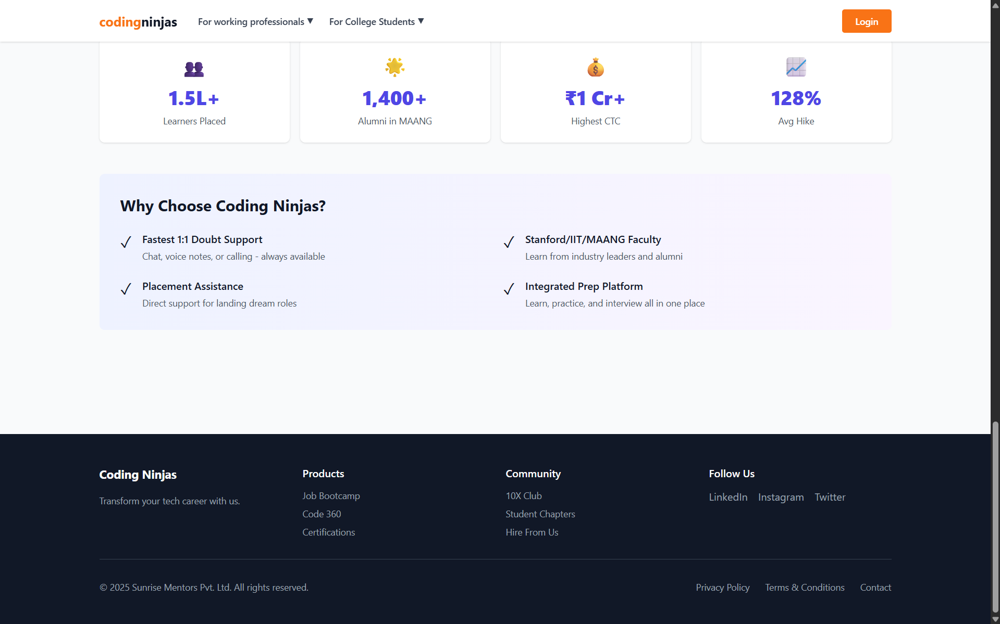

# Coding Ninjas Clone (React + Vite + Tailwind)

A modern, responsive educational website clone built with React, Vite, and Tailwind CSS, inspired by Coding Ninjas' design and functionality.

## 🎨 Screenshots

### Homepage Hero Section


### Our Courses Section


### Course Cards & Details


## 🚀 Features

- **Responsive Design** - Works seamlessly on desktop, tablet, and mobile devices
- **Modern UI** - Clean and professional interface with Tailwind CSS
- **Interactive Components** - Dropdown menus, course finder form, and category filters
- **Course Listings** - Browse courses by category (Data Analytics, GenAI, Full Stack)
- **Student Success Stories** - Showcase learner achievements and placements
- **Faculty Section** - Display instructor profiles and expertise
- **SEO Friendly** - Properly structured HTML and semantic markup

## 📋 Tech Stack

- **Frontend Framework** - React 18.2
- **Build Tool** - Vite 5.0
- **Styling** - Tailwind CSS 3.4
- **Node Package Manager** - npm

## 🛠️ Installation & Setup

### Prerequisites
- Node.js (v14 or higher)
- npm (v6 or higher)

### Quick Start

```powershell
# 1. Navigate to project directory
cd "C:\Users\Naman Gaonkar\Desktop\AITD\Codexintern internship"

# 2. Install dependencies
npm install

# 3. Start development server
npm run dev
```

The app will be available at `http://localhost:5173`

## 📦 Available Scripts

```powershell
# Development server (with hot reload)
npm run dev

# Build for production
npm run build

# Preview production build
npm run preview
```

## 📁 Project Structure

```
src/
├── components/
│   ├── Header.jsx          # Navigation with dropdowns
│   ├── Hero.jsx            # Hero section with course finder form
│   ├── Courses.jsx         # Courses section with filters
│   ├── Stats.jsx           # Statistics and achievements
│   └── Footer.jsx          # Footer with links
├── App.jsx                 # Main app component
├── main.jsx                # React entry point
├── index.css               # Tailwind CSS directives
├── index.html              # HTML template
└── package.json            # Dependencies and scripts
```

## 🎯 Components Overview

### Header
- Top banner with AI courses link
- Navigation with dropdown menus
- "For working professionals" and "For College Students" sections
- Domain, Certification, and Job bootcamp categories

### Hero Section
- Dark gradient background
- Course finder form with:
  - Experience level selection
  - Topic of interest dropdown
  - Name, phone, email inputs
  - Form validation placeholder
- Achievement statistics sidebar

### Courses Section
- Category filter tabs (All, Data Analytics, Generative AI, Full Stack Development)
- Course cards with:
  - Gradient background images
  - Institution badges
  - Duration information
  - Skill icons

### Stats Section
- Key achievement metrics
- Why choose Coding Ninjas benefits
- Testimonial section ready for integration

### Footer
- Company information
- Product links
- Community links
- Social media links

## 🎨 Customization

### Colors
Edit the Tailwind classes in components to change colors:
- Primary Color: `orange-500` (button, accents)
- Dark Background: `gray-900` (hero section)
- Light Background: `white` / `gray-50`

### Fonts
Add custom fonts in `src/index.css`:
```css
@import url('https://fonts.googleapis.com/css2?family=YourFont:wght@400;600;700&display=swap');
```

### Images
Replace emoji placeholders with actual images by modifying the `gradient` and `emoji` fields in component data.

## 📱 Responsive Breakpoints

- **Mobile** - < 640px
- **Tablet** - 640px to 1024px
- **Desktop** - > 1024px

## 🔧 Configuration Files

- **`tailwind.config.cjs`** - Tailwind CSS configuration
- **`postcss.config.cjs`** - PostCSS configuration for Tailwind
- **`package.json`** - Project dependencies and scripts

## 📝 Notes

- This is an educational project for learning React and Tailwind CSS
- Images in the cards are currently emojis; replace with actual course images
- Form submissions are logged to console; integrate with backend as needed
- Responsive design tested on common screen sizes

## 🚀 Deployment

### Deploy to Vercel (Recommended)

```powershell
npm install -g vercel
vercel
```

### Deploy to Netlify

```powershell
npm run build
# Upload dist/ folder to Netlify
```

## 📄 License

This project is for educational purposes. Coding Ninjas is a registered trademark of Sunrise Mentors Pvt. Ltd.

## 👨‍💻 Developer

Built for learning React, Vite, and Tailwind CSS

---

Made with ❤️ for aspiring developers

